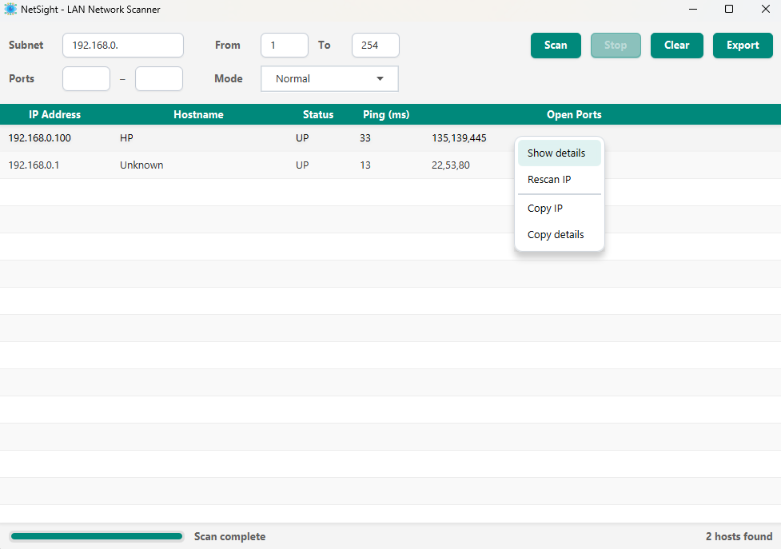

# NetSight — LAN Network Scanner

A simple LAN network scanner built with JavaFX.
Discover active hosts on your network, resolve hostnames, measure ping, and identify open ports .

---

## Features

- **Host discovery** — scans a full subnet or a single IP address
- **Port scanning** — configurable port range with concurrent scanning
- **Hostname resolution** — reverse-DNS lookup for each alive host
- **Ping measurement** — round-trip time per host in milliseconds
- **Scan modes** — Fast / Normal / Deep with preset thread and timeout values
- **Scan statistics** — total time, average per host, alive hosts, hosts with open ports
- **Right-click menu** — show details, rescan IP, copy IP, copy details
- **Export to TXT** — save all results to a text file
- **Single IP mode** — leave From/To empty to scan one specific IP

---

## Tech Stack

| Technology | Purpose |
|---|---|
| Java 17 | Core language |
| JavaFX 21 | Desktop UI |
| Lombok | Boilerplate reduction |
| Maven | Build tool |

---

## Project Structure

```
src/main/
├── java/com/ayoub/netsight/
│   ├── NetSightApp.java              ← Entry point
│   ├── controllers/
│   │   └── MainController.java       ← UI controller
│   ├── model/
│   │   └── HostInfo.java             ← Host data model
│   ├── services/
│   │   ├── ScanService.java          ← Orchestrates subnet scan
│   │   ├── HostScanner.java          ← Probes a single IP
│   │   └── PortScanner.java          ← TCP port probing
│   └── utils/
│       ├── NetworkUtil.java           ← Local IP detection
│       └── JavaFxUtils.java          ← UI helpers
└── resources/
    ├── fxml/main.fxml                ← UI layout
    ├── css/style.css                 ← Stylesheet
    └── icons/                        ← App icons
```

---

## How It Works

1. `ScanService` creates a fixed thread pool and submits one `HostScanner` task per IP
2. Each `HostScanner` pings the host via `InetAddress.isReachable()`, resolves the hostname, then calls `PortScanner`
3. `PortScanner` probes each port concurrently using `Socket.connect()` with a configurable timeout
4. Results are dispatched back to the JavaFX thread via `Platform.runLater()` and streamed into the `TableView` in real time

---

## Scan Modes

| Mode | Threads | Timeout | Best for |
|---|---|---|---|
| Fast | 100 | 100ms | Quick LAN sweep |
| Normal | 50 | 200ms | Default, balanced |
| Deep | 30 | 500ms | Slow or remote hosts |

---

## Getting Started

### Prerequisites
- JDK 17+
- Maven 3.8+

### Run
```bash
mvn clean javafx:run
```

### Build fat JAR
```bash
mvn clean package
```

Output: `target/NetSight-1.0-SNAPSHOT.jar`

---

## Usage

| Field | Description |
|---|---|
| Subnet | Full IP (e.g. `192.168.1.5`) or subnet prefix (e.g. `192.168.1.`) |
| From / To | Host range — leave empty to scan a single IP |
| Ports | Port range to probe (default: 1–1024) |
| Mode | Scan speed preset |

**Right-click any row** for: Show details, Rescan IP, Copy IP, Copy details.

---

## Screenshots

**Main window**


## Author

**Ayoub Elhatab**
[LinkedIn](https://www.linkedin.com/in/ayoub-elhatab/) · [GitHub](https://github.com/Ayoub-Elhatab)